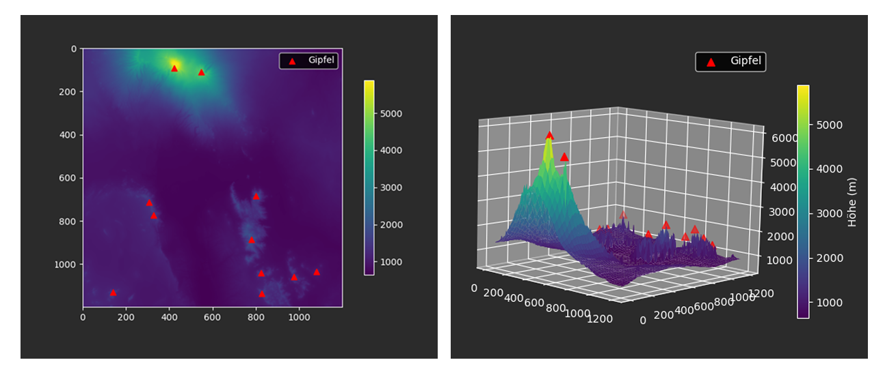
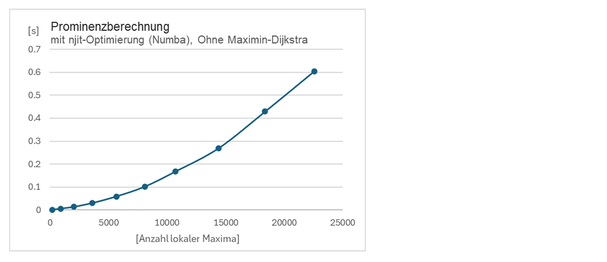

# Gipfelfinder

## Installation der Abhängigkeiten

Bevor man das Tool nutzen kann, benötigt man GDAL (für rasterio) und die in `requirements.txt` genannten Python-Pakete.

### GDAL installieren

#### Conda (systemunabhängig)

Mit Conda lässt sich GDAL systemunabhängig herunterladen:

    conda install -c conda-forge gdal

#### Windows

1. Lade den OSGeo4W Network Installer herunter:  
   https://trac.osgeo.org/osgeo4w/ (`osgeo4w-setup.exe`)  
2. Starte den Installer und wähle **Express** oder **Advanced** Installation.  
3. Wähle das Paket **gdal** aus und führe die Installation durch.  

#### macOS

Mit Homebrew:

    brew install gdal

#### Linux

Beispiel für Ubuntu/Debian:

    sudo apt-get update
    sudo apt-get install gdal-bin libgdal-dev

## Nutzung

1. Lade eine GeoTIFF-DEM-Datei über den Button **"Karte hochladen"** hoch (in /images sind Beispieldateien vorhanden). 
2. Gib Schwellenwerte ein (z.B. **Prominenz**, **Dominanz**) oder wähle eine Voreinstellung.  
3. Klicke auf **"Gipfel finden"**, um alle prominenten Gipfel in 2D oder 3D zu ermitteln und darzustellen.  
4. Betrachte die Ergebnisse im interaktiven Plot und in der Tabelle mit Pixel- und WGS84-Koordinaten.  

## Funktionen

- Erkennung lokaler Maxima in digitalen Höhenmodellen (DEMs)  
- Berechnung der **Prominenz** (Höhendifferenz zum höchsten Sattel)  
- Berechnung der **Dominanz** (Luftlinien-Entfernung zum nächstgelegenen höheren Punkt)  
- Einstellbare Schwellwerte und voreingestellte Modi  
- 2D-Overlay und interaktive 3D-Visualisierung der Geländeoberfläche  
- Exportierbare Tabelle der Gipfelkoordinaten (Pixel und WGS84)  

## UI

Unten ist das Hauptfenster der Anwendung mit einer geladenen Kilimandscharo-Karte zu sehen:

Die Benutzeroberfläche ermöglicht die Anzeige der Karte sowohl in einer klassischen 2D-Ansicht als auch in einer interaktiven 3D-Visualisierung:

## Genauigkeit und Performance

### Genauigkeit
Für die Genauigkeit wurden die erkannten Gipfel mit den bekannten Viertausendern der Walliser Alpenregion verglichen:

### Performance
Der folgende Graph veranschaulicht die Performance der Anwendung:
